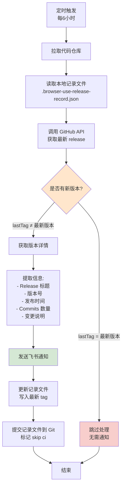

# Browser-Use Release Monitor

## 目的

通过 GitHub Actions 自动监控 [browser-use](https://github.com/browser-use/browser-use) 项目的版本发布，及时获取重大更新信息。

## 工作机制

- **监控频率**：每 6 小时检查一次
- **通知方式**：飞书机器人推送
- **防重复**：记录已处理的版本，避免重复通知

## 流程图

## 通知内容

每次新版本发布时，飞书会收到包含以下信息的消息：

- 🏷️ **Release 标题**
- 📦 **版本号**
- 📅 **发布时间**
- 📝 **Commits 数量**
- 🔍 **主要变更**（前10条 commit）
- 🔗 **提交对比链接**
- 🔗 **Release 详情链接**

## 配置

需要在 GitHub Repository Secrets 中配置：
- `LARK_WEBHOOK_URL`：飞书机器人的 Webhook 地址

